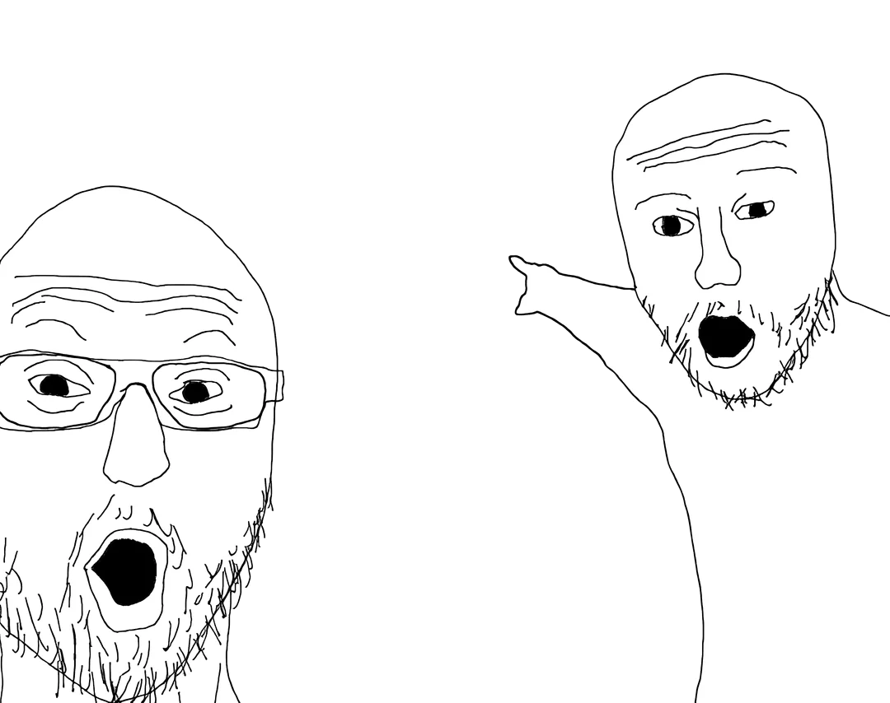

# Wojak Crosshair Overlay


A lightweight, transparent crosshair overlay for games that don't provide crosshair customization or for any other application where a screen overlay might be useful.

## Features

- Transparent, always-on-top crosshair overlay
- Customizable size using mouse scroll or keyboard shortcuts
- Draggable position
- Minimal resource usage
- Works with any game or application in windowed or borderless fullscreen modes

## Requirements

- Python 3.6+
- GTK 3.0+
- PyGObject
- A compositing window manager (for transparency support)

## Installation

1. Clone this repository:
   ```bash
   git clone https://github.com/agilarasu/wojak-crosshair.git
   cd wojak-crosshair
   ```

2. Install the required dependencies:
   ```bash
   pip install -r requirements.txt
   ```

   For Ubuntu/Debian systems, you might also need:
   ```bash
   sudo apt-get install python3-gi python3-gi-cairo gir1.2-gtk-3.0
   ```

   For Fedora:
   ```bash
   sudo dnf install python3-gobject python3-cairo gtk3
   ```

   For Arch Linux:
   ```bash
   sudo pacman -S python-gobject python-cairo gtk3
   ```

3. Ensure you have a crosshair image named `crosshair.png` in the same directory as the script.

## Usage

Run the application:
```bash
python3 main.py
```

### Controls

- **Left mouse button + drag**: Move the crosshair
- **Mouse scroll wheel**: Resize the crosshair (smaller/larger)
- **+/= key**: Increase crosshair size
- **- key**: Decrease crosshair size
- **Escape key**: Exit the application

## Customization

Replace the `crosshair.png` file with your own PNG image. For best results, use a PNG with transparency.

## Notes

- The application works best with compositing window managers that support transparency
- Some fullscreen exclusive games may not display the overlay
- For Steam games, try running them in "Borderless Window" mode

## License

This project is licensed under the MIT License. See the [LICENSE](LICENSE) file for details.

## Contributing

Contributions are welcome! Please feel free to submit a Pull Request.
